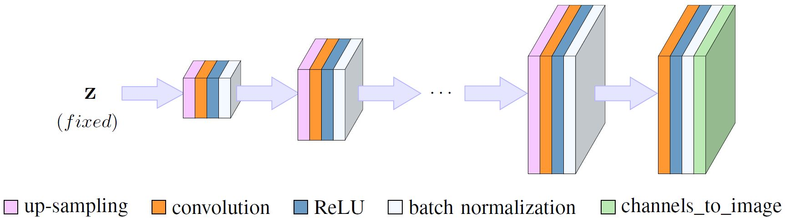

# ConvDecoder

Check out our colab-demo for a quick example on how the decoder works for multi-coil accelerated MRI reconstruction:

[](https://colab.research.google.com/drive/1xu_NS6ClikkOM1TTPL7EDqOjQZCvCvlL#offline=true&sandboxMode=true)<br>


<p align="center"></p>

<br>
This repository provides code for reproducing the results in the paper:

**''Accelerated MRI with Un-trained Neural Networks''** by Mohammad Zalbagi Darestani and Reinhard Heckel

Code by: Mohammad Zalbagi Darestani (mz35@rice.edu) and Reinhard Heckel (rh43@rice.edu)
***

The aim of the code is to investigate the capability of different un-trained methods, including our proposed ConvDecoder, for the MRI acceleration problem. The task is to recover a fine image from a few measurements. We provide experiments to:

(i) compare ConvDecoder with U-net, a standard popular trained method for medical imaging, on the FastMRI validation set (**ConvDecoder_vs_Unet_multicoil.ipynb**), 

(ii) compare ConvDecoder with Deep Decoder and Deep Image Prior, two popular un-trained methods for standard inverse problems, again, on the FastMRI dataset (**ConvDecoder_vs_DIP_vs_DD_multicoil.ipynb**),

(iii) compare ConvDecoder with U-net on an out-of-distribution sample to demonstrate the robustness of un-trained methods toward a shift in the distribution at the inference time (**robustness_to_distribution_shift.ipynb**), 

(iv) and finally, visualize the output of ConvDecoder layers to illustrate how ConvDecoder, as a convolutional generator, finds a fine representation of an image (**visualize_layers_singlecoil.ipynb**).

### List of contents
* [Setup and installation](#Setup-and-installation) <br>
* [Dataset](#Dataset) <br>
* [Running the code](#Running-the-code) <br>
* [References](#References) <br>
* [License](#License)
***

# Setup and installation
On a normal computer, it takes aproximately 10 minutes to install all the required softwares and packages.

### OS requirements
The code has been tested on the following operating system:

	Linux: Ubuntu 16.04.5

### Python dependencies
To reproduce the results by running each of the jupyter notebooks, the following softwares are required. Assuming the experiment is being performed in a docker container or a linux machine, the following libraries and packages need to be installed.

        apt-get update
        apt-get install python3.6     # --> or any other system-specific command for installing python3 on your system.
		pip install jupyter
		pip install numpy
		pip install matplotlib
		pip install sigpy
		pip install h5py
		pip install scikit-image
		pip install runstats
		pip install pytorch_msssim
		pip install pytorch-lightning==0.7.5
		pip install test-tube
		pip install Pillow
		
If pip does not come with the version of python you installed, install pip manually from [here](https://ehmatthes.github.io/pcc/chapter_12/installing_pip.html). Also, install pytorch from [here](https://pytorch.org/) according to your system specifications. 

# Dataset
All the experiments are performed on the [FastMRI](https://fastmri.org/dataset) dataset--except the experiment for measuring the robustness toward out-of-distribution samples which is performed on the cameraman test image.

# Running the code
You may simply clone this repository and run each notebook to reproduce the results. **Note** that you need to download the [FastMRI](https://fastmri.org/dataset) dataset and change the **data path** (when loading the measurements) in each notebook accordingly, provided that you intend to run the code for MRI data (for MRI data, all of our experiments are performed on the validation sets--either single-coil or multi-coil).

# References
Code for training the U-net is taken from [here](https://github.com/facebookresearch/fastMRI/tree/master/models/unet). <br>
Code for Deep Decoder and Deep Image Prior architectures are taken from [repo1](https://github.com/reinhardh/supplement_deep_decoder) and [repo2](https://github.com/DmitryUlyanov/deep-image-prior), respectively.

# License
This project is covered by **Apache 2.0 License**.

## Citation
If you find our work useful in your research, please cite:
```
@inproceedings{,
    author = {Zalbagi Darestani, Mohammad and Heckel, Reinhard},
    title = {Accelerated MRI with Un-trained Neural Networks},
    booktitle = {arXiv:2007.02471},
    year={2020}
}
```
